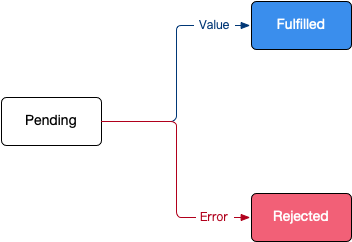

# Node.js 异步编程

## 1. Node.js 的非阻塞 I/O

> 目标：了解 Node.js 是通过异步实现的非阻塞 I/O，以及非阻塞 I/O 的好处。

1. I/O（Input / Output），是**输入**和**输出**的意思；
2. **阻塞 I/O** 和**非阻塞 I/O** 的区别在于：**系统接收输入再到输出期间，能不能接收其他输入**。

示例：“这个 Node.js 问题怎么解决？在线等，急。”

1. **阻塞 I/O**：不停刷新，直到等到答案为止，期间不会干别的事情；
2. **非阻塞 I/O**：去干点别的，待会儿回来看看是否有人回帖了。

### 1.1 阻塞 I/O 和非阻塞 I/O 代码演练

1. 新建 `ch2-6-async-io` 目录
2. 初始化 npm 包并安装 `glob`

   ```bash
   npm init -y

   npm i glob
   ```

3. 新建 `index.js` 并实现以下代码，测试**阻塞 I/O**：

   ```js
   const glob = require('glob')

   // 演示 1：阻塞 I/O
   console.time('glob')
   // 遍历所有子目录中的 js 文件
   const result = glob.sync(__dirname + '/**/*.js')
   console.timeEnd('glob')
   console.log(result)
   ```

   运行程序，可以看到在**阻塞 I/O** 模式下遍历所有文件耗时 16ms+。

4. 修改代码，测试**非阻塞 I/O**：

   ```js
   // 演示 2：非阻塞 I/O
   console.time('glob')
   // 异步遍历所有子目录中的 js 文件
   glob(__dirname + '/**/*.js', (err, res) => {
     console.log(res)
   })
   console.timeEnd('glob')
   console.log('随机数：', Math.floor(Math.random() * 100))
   ```

   运行程序，可以看到在**非阻塞 I/O** 模式下遍历所有文件耗时 1ms+。

## 2. callback 回调函数

> 目标：了解 Node.js callback 的规范及基本写法，知道**异步流程控制**在开发中的 2 个难点（**回调地域** + **异步并发**）。

回调函数格式规范（**error-first callback**）：第一个参数是 error，后面的参数才是结果。

### 2.1 模拟面试（回调规范）

- 需求场景：去参加面试，500 毫秒后通知面试结果，面试通过率 50%。
- 代码如下：

  ```js
  /**
   * 面试函数，500 毫秒后通知面试结果，面试通过率 50%
   * @param {*} callback
   */
  const interview = (callback) => {
    setTimeout(() => {
      if (Math.random() >= 0.5) {
        callback(null, 'success')
      } else {
        callback(new Error('fail'))
      }
    }, 500)
  }

  // 场景 1：只参加一轮面试
  interview((err, res) => {
    if (err) {
      return console.log('面试未通过：', err.message)
    }
    console.log('面试通过：', res)
  })
  ```

### 2.2 回调地域

所谓**回调地域**指的是：在回调中继续调用异步操作，导致**嵌套层次太深，代码不好维护**。

修改上一小节业务需求，假设**需要 3 轮面试**，修改后的代码如下：

```js
// 场景 2：要参加 3 轮面试
interview((err, res) => {
  if (err) {
    return console.log('第 1 轮面试失败：', err.message)
  }
  console.log('第 1 轮面试通过，准备 2 面')

  interview((err, res) => {
    if (err) {
      return console.log('第 2 轮面试失败：', err.message)
    }
    console.log('第 2 轮面试通过，准备 3 面')

    interview((err, res) => {
      if (err) {
        return console.log('第 3 轮面试失败：', err.message)
      }

      console.log('面试通过：', res)
    })
  })
})
```

### 2.3 异步并发

所谓**异步并发**指的是：多个异步执行结束后，统一做后续处理，如果不使用 ES6+ 提供的异步方案，代码逻辑编写难度较高，且不好维护。

> 提示：以前社区上针对**异步并发**的解决方案有 [async](https://www.npmjs.com/package/async) 。

修改上一小节业务需求，假设**面试者期望拿到 2 个 Offer**，修改后的代码如下：

```js
/**
 * 面试函数，500 ~ 700 毫秒后通知面试结果，面试通过率 50%
 * @param {*} callback
 */
const interview = (callback) => {
  setTimeout(() => {
    if (Math.random() >= 0.5) {
      callback(null, 'success')
    } else {
      callback(new Error('fail'))
    }
  }, 500 + Math.floor(Math.random() * 200))
}

// 场景 3：面试者期望拿到 2 个 Offer
let count = 0

interview((err, res) => {
  if (err) {
    return console.log('第 1 家公司面试失败：', err.message)
  }
  console.log('拿到第 1 家 Offer', res)

  count++
  if (count === 2) {
    console.log('拿到 2 个 Offer，先 2 后 1')
  }
})

interview((err, res) => {
  if (err) {
    return console.log('第 2 家公司面试失败：', err.message)
  }
  console.log('拿到第 2 家 Offer', res)

  count++
  if (count === 2) {
    console.log('拿到 2 个 Offer，先 1 后 2')
  }
})
```

## 3. 事件循环

> 目标：了解 Node.js 事件循环的基本实现机制 - 持续轮训，一旦检测到**事件队列**里存在回调方法，就将**回调方法出队并执行**。

简单事件循环的模拟需求：

1. 每隔 1 秒检测一下 `queue` 是否有回调函数；
2. 如果有，从队列中取出**第一个回调**并执行；
3. 用户可以利用**非阻塞 I/O** 输入任意模拟事件的名称，例如：键盘输入、鼠标输入；
4. 如果用户输入的是 `exit` 程序结束。

注意：每一次回调函数的执行，都是在新的调用栈上执行的，要注意 this 的绑定。

```js
const eventloop = {
  // 事件队列
  queue: [],
  // 循环方法
  loop() {
    console.log('请输入模拟事件，exit 退出')

    // 处理事件队列
    while (this.queue.length) {
      this.queue.shift()()
    }

    setTimeout(this.loop.bind(this), 2000)
  },
  // 向事件队列添加回调
  add(callback) {
    this.queue.pop(callback)
  }
}

eventloop.loop()

process.stdin.on('data', e => {
  const event = e.toString().trim()

  if (event === 'exit') {
    process.exit()
  }
  eventloop.add(console.log(`检测到 ${event} 事件……`))
})
```

## 4. Promise

> 目标：了解 Promise 的状态流转并能够使用 Promise 实现常规的异步编程。

### 4.1 Promise 概念

- 字面含义：承诺，期约，表示**当前事件循环得不到的结果，会在未来的事件循环得到**；
- Promise 是一个**状态机**，包含三个状态：`pending`、`fulfilled`/`resolved`、`rejected`，如下图所示：

  

### 4.2 Promise 实例化和状态流转

使用 `new Promise` 可以创建一个 Promise 对象，代码如下：

```js
let promise = new Promise(function (resolve, reject) {})
```

其中：

- `resolve` 可以把 Promise 的状态从 `pending` 流转到 `fulfilled`；
- `reject` 可以把 Promise 的状态从 `pending` 流转到 `rejected`；
- 注意：`resolve` 和 `reject` 状态之间**不能相互转换**。

### 4.3 .then 和 .catch

Promise 是一个**状态机**，当 Promise 的状态发生流转时，会根据状态调用不同的回调方法 `then` 和 `catch`，其中：

- `resolved` 状态的 Promise 会回调后面的第一个 `.then`；
- `rejected` 状态的 Promise 会回调后面的第一个 `.catch`；
- 任何一个 `rejected` 状态且后面没有 `.catch` 的 Promise，都会造成浏览器 / Node 环境的全局错误。

示例代码如下：

```js
const promise = new Promise((resolve, reject) => {
  setTimeout(() => {
    // resolve('padding to fulfilled')
    reject(new Error('error: padding to error'))
  }, 300)
}).then(res => console.log(res))
  .catch(err => console.log(err.message))
```

执行 `.then` 和 `.catch` 会**返回一个新的 Promise**，该 Promise 最终状态根据 `.then` 和 `.catch` 的**回调函数的执行结果**决定：

- 如果该回调函数最终是 `throw`，则该 Promise 是 rejected 状态
- 如果该回调函数最终是 `return`，则该 Promise 是 resolved 状态
- 但如果回调函数最终 return 了一个 Promise，该 Promise 会和回调函数 return 的 Promise 状态保持一致

### 4.4 Promise 实现模拟面试

1. 改造后的面试函数

   ```js
   /**
    * 面试函数，500 ~ 700 毫秒后通知面试结果，面试通过率 50%
    *
    * @param {String} companyName 面试公司名
    * @param {Number} round 面试轮数
    * @returns Promise
    */
   const interview = (companyName, round) => {
     return new Promise((resolve, reject) => {
       setTimeout(() => {
         if (Math.random() >= 0.5) {
           resolve(`面试 ${companyName} 第 ${round} 轮通过`)
         } else {
           reject(new Error(`面试 ${companyName} 第 ${round} 轮失败...`))
         }
       }, 500 + Math.floor(Math.random() * 200))
     })
   }
   ```

2. 场景一：只参加一轮面试

   ```js
   interview('ali', 1)
     .then(res => console.log(res))
     .catch(err => console.log(err.message))
   ```

3. 场景二：要参加 3 轮面试

   ```js
   interview('ali', 1)
     .then(res => {
       console.log(res)
       return interview('ali', 2)
     })
     .then(res => {
       console.log(res)
       return interview('ali', 3)
     })
     .then(res => console.log(res))
     .catch(err => console.log(err.message))
   ```

4. 场景 3：面试者期望拿到 2 个 Offer

   ```js
   Promise
     .all([
       interview('ali', 1)
         .then(res => {
           console.log(res)
           return interview('ali', 2)
         })
         .then(res => {
           console.log(res)
           return interview('ali', 3)
         }),
       interview('360', 1)
     ]).then(res => console.log(res))
     .catch(err => console.log(err.message))
   ```

   > 使用 `Promise.all` 基本上能够满足日常大部分的**异步并发**开发需求。

## 5. Node.js 异步编程 - async/await

> 目标：知道 async & await 的特点，并能够使用 async 实现异步编程。

### 5.1 async 是 Promise 的语法糖

`async function` 本质上是 Promise 的语法糖封装，就是一个返回 Promise 的普通函数，验证代码如下：

```js
// 1. 对比 resolove 的 async & Promise
console.log(async function () {
  return 'hello async'
}())

console.log(function () {
  return Promise.resolve('hello async')
}())

// 2. 对比 rejected 的 async & Promise
console.log(async function () {
  throw new Error('rejected async')
}())

console.log(function () {
  return Promise.reject(new Error('rejected async'))
}())
```

### 5.2 async/await 以同步的方式做异步开发

1. `await` 可以“暂停” `async function` 的执行；
2. `await` 可以以同步的方式获取 Promise 的执行结果；
3. `try-catch` 可以获取 `await` 所得到的的错误。

示例代码如下：

```js
const result = (async () => {
  let content = null
  try {
    content = await new Promise((resolve, reject) => {
      setTimeout(() => {
        // 1. 测试 content 获取 resolve 的结果
        // resolve('hello await')
        // 2. 测试 try-catch 捕获 reject 的错误
        reject(new Error('rejected'))
      }, 500)
    })
  } catch (e) {
    console.log(e.message)
  }
  console.log(content)

  return 'async & aswit'
})()

setTimeout(() => {
  console.log('====>', result)
}, 800)
```

### 5.3 async/await 实现模拟面试

1. 场景一：只参加一轮面试

   ```js
   (async () => {
     try {
       const res = await interview('ali', 1)
       console.log(res)
     } catch (err) {
       console.log(err.message)
     }
   })();
   ```

2. 场景二：要参加 3 轮面试

   ```js
   (async () => {
     try {
       console.log(await interview('ali', 1))
       console.log(await interview('ali', 2))
       console.log(await interview('ali', 3))
     } catch (err) {
       console.log(err.message)
     }
   })();
   ```

3. 场景 3：面试者期望拿到 2 个 Offer

   ```js
   (async () => {
     try {
       const result = await Promise.all([
         interview('ali', 1),
         interview('360', 1)
       ])
       console.log(result)
     } catch (err) {
       console.log(err.message)
     }
   })()
   ```
