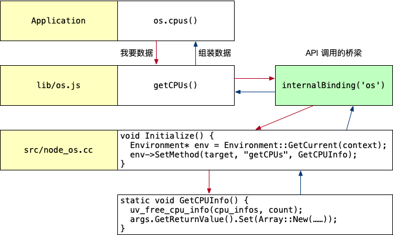
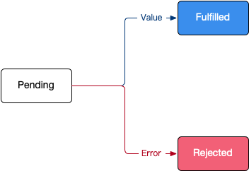

# Node.js 开发实战

课程信息

1. 课程名称：Node.js 开发实战
2. 主讲：杨浩

## 1. 基础知识

### 1.1 Node.js 是什么？

Node.js 是一个 JavaScript 的运行环境，与 Chrome 的区别是：

- Node.js 没有浏览器 API，如：`document`、`window` 等
- Node.js 中增加了许多 API，如：文件系统、进程等

对于开发者来说：

- 在 Chrome 里写 JavaScript 可以控制浏览器
- 使用 Node.js 可以让你用类似的方式控制整个计算机

官网概念：

1. Node.js 是一个基于 **Chrome V8 引擎**的 JavaScript 运行环境
2. Node.js 使用了一个**事件驱动**、**非阻塞式 I/O** 的模型，使其轻量又高效

### 1.2 Node.js 可以用来做什么？

1. Web 服务器（服务端渲染 + 前后端同构）
   1. 服务端渲染 = 搜索引擎优化 + 首屏速度优化
2. 构建工作流
   1. 使用 Node.js 做 JS 构建工具比较保险
   2. 常用构建工具：gulp、webpack
3. 开发工具 - Visual Studio Code
4. 游戏 - wayward
5. 客户端应用 - twitch.tv

## 2. 技术预研

### 2.1 软件安装

1. Chrome：<https://www.google.com/chrome/thank-you.html?standalone=1>
2. Visual Studio Code：<https://code.visualstudio.com/Download>
3. Node.js：<https://nodejs.org>

在控制台输入以下命令可以测试 Node.js 是否安装成功：

```bash
# 测试 Node.js 安装
node -v

# 测试 npm 安装
npm -v
```

### 2.2 第一个实战 - 石头剪刀布

> 目标：了解 Node.js 的**运行方式**以及在 Node.js 中的**全局变量**。

#### 2.2.1 运行方式及全局变量

1. 在命令行输入：`node js文件名.js` 可以运行对应的 js 脚本
2. 新建 `ch2-2-global-var.js` 并输入以下代码：

   ```js
   /**
    * 与 Chrome 一致的对象或函数
    */
   console.log(Date)
   console.log(Math)

   console.log(setTimeout)
   console.log(setInterval)

   // 注意：requestAnimationFrame 是浏览器渲染的下一帧，Node.js 中不支持
   // console.log(requestAnimationFrame)
   // Node.js 中提供了替代函数，当要异步（但要尽可能快）执行某些代码时使用
   console.log(setImmediate)

   /**
    * Node.js 特有的环境变量
    */
   // 当前运行脚本的文件名
   console.log(__filename)
   // 当前运行脚本所在目录位置
   console.log(__dirname)

   // 进程对象
   console.log(process)
   ```

3. `process` 对象中几个重要属性如下：

   1. `argv`：命令行程序的命令及参数列表
   2. `env`：Node 当前运行环境的环境变量，程序员可以根据需要增加环境变量
   3. `cpuUsage`：CPU 占用率
   4. `memoryUsage`：内存占用率
   5. `hrtime`：可以用于时间统计

#### 2.2.2 石头剪刀布（原始版）

##### 2.2.2.1 需求说明

1. 用户在命令行输入 `node ch2-2-rock.js 石头`，表示用户出拳是**石头**
2. 电脑**随机**生成石头、剪刀、布
3. 判定胜负并输出胜负结果

##### 2.2.2.2 代码实现

1. 新建 `ch2-2-rock.js` 并输入以下代码：

   ```js
   // 1. 从命令行获取用户行为
   const player = process.argv[process.argv.length - 1]
   console.log('玩家出拳：', player)

   // 2. 电脑随机出拳
   const random = Math.floor(Math.random() * 3)
   let computer

   if (random === 0) {
     computer = '石头'
   } else if (random === 1) {
     computer = '剪刀'
   } else {
     computer = '布'
   }
   console.log('计算机出拳：', computer)

   // 3. 比较结果
   if (player === computer) {
     console.log('平局')
   } else if (
     (player === '石头' && computer === '剪刀') ||
     (player === '剪刀' && computer === '布') ||
     (player === '布' && computer === '石头')
   ) {
     console.log('你赢了')
   } else {
     console.log('你输了')
   }
   ```

2. 在控制台多次输入 `node ch2-2-rock.js 石头` 验证游戏效果

### 2.3 模块规范

> 目标：了解 CommonJS 模块规范及基本使用。

以前使用 `script` 标签加载脚本存在以下问题：

1. 脚本变多时，需要手动管理加载顺序
2. 不同脚本之间逻辑调用，需要通过全局变量，例如 `jQuery` 的 `$`
3. 没有 html 怎么办？

#### 2.3.1 CommonJS 模块规范概念

CommonJS 模块规范是开发一个大型 Node.js 程序的基础，CommonJS 是由 JavaScript 社区发起的，后来在 Node.js 上被应用并推广，后续也影响到了浏览器端 JavaScript 的编写。

#### 2.3.2 使用 require 引用外部模块

1. 新建 `ch2-3-commonjs/lib.js` 输入以下代码：

   ```js
   // 外部模块
   console.log('hello module')
   ```

2. 新建 `ch2-3-commonjs/index.js` 输入以下代码：

   ```js
   console.log('start require')
   const lib = require('./lib.js')
   console.log('end require', lib)
   ```

3. 运行 `index.js` 输出效果如下：

   ```bash
   start require
   hello module
   end require {}
   ```

4. 使用 `webpack  --mode development --no-devtool ./index.js` 可以查看 `require` 的代码实现如下：

   ```js
   function __webpack_require__(moduleId) {
     // Check if module is in cache
     var cachedModule = __webpack_module_cache__[moduleId];
     if (cachedModule !== undefined) {
       return cachedModule.exports;
     }
     // Create a new module (and put it into the cache)
     var module = __webpack_module_cache__[moduleId] = {
       // no module.id needed
       // no module.loaded needed
       exports: {}
     };

     // Execute the module function
     __webpack_modules__[moduleId](module, module.exports, __webpack_require__);

     // Return the exports of the module
     return module.exports;
   }
   ```

   **结论**：使用 `require` 引用模块时，被引用模块中的代码会**被执行一次**。

#### 2.3.3 使用 exports 导出方法或变量

模块上下文提供了 `exports` 对象用于导出当前模块的方法或者变量。

1. 修改 `lib.js` 代码如下：

   ```js
   // exports 是模块上下文提供的对象，用于导出变量或方法
   console.log('lib 模块', exports)

   exports.username = 'zhangsan'

   exports.person = {
     name: 'zhangsan',
     age: 18,
     gender: 'male'
   }

   exports.add = (a, b) => a + b

   setTimeout(() => console.log(exports), 1000)
   ```

2. 修改 `index.js` 代码如下：

   ```js
   console.log('start require')
   const lib = require('./lib.js')
   console.log('end require', lib)

   // 向 lib 模块的 exprots 对象添加对象
   lib.testObj = { desc: 'hello module' }
   ```

3. 运行 `index.js` 输出效果如下：

   ```bash
   start require
   hello module
   lib 模块 {}
   end require {
     username: 'zhangsan',
     person: { name: 'zhangsan', age: 18, gender: 'male' },
     add: [Function (anonymous)]
   }
   {
     username: 'zhangsan',
     person: { name: 'zhangsan', age: 18, gender: 'male' },
     add: [Function (anonymous)],
     testObj: { desc: 'hello module' }
   }
   ```

#### 2.3.4 使用模块改造石头剪刀布游戏

##### 2.3.4.1 需求说明

1. 用户**循环在控制台输入**：石头、剪刀、布
2. 电脑**随机**生成石头、剪刀、布
3. 判定胜负并输出胜负结果
4. 如果**电脑输的次数超过三次**，终止游戏

##### 2.3.4.2 代码实现

1. 新建 `ch2-3-commonjs/game.js`，复制 `ch2-2-rock.js` 的代码并改造如下：

   ```js
   exports.game = (player) => {
     console.log('玩家出拳：', player)

     // 计算机随机出拳
     const random = Math.floor(Math.random() * 3)
     let computer

     if (random === 0) {
       computer = '石头'
     } else if (random === 1) {
       computer = '剪刀'
     } else {
       computer = '布'
     }
     console.log('计算机出拳：', computer)

     // 比较结果
     if (player === computer) {
       console.log('平局')

       return 0
     } else if (
       (player === '石头' && computer === '剪刀') ||
       (player === '剪刀' && computer === '布') ||
       (player === '布' && computer === '石头')
     ) {
       console.log('你赢了')

       return 1
     } else {
       console.log('你输了')

       return -1
     }
   }
   ```

2. 修改 `ch2-3-commonjs/index.js` 代码如下：

   ```js
   const { game } = require('./game.js')

   let count = 0
   process.stdin.on('data', e => {
     const player = e.toString().trim()

     if (game(player) === 1) {
       // 记录计算机输的次数
       count++
     }
     if (count === 3) {
       console.log('你真是太厉害了，我不玩了')
       process.exit()
     }
   })
   ```

### 2.4 npm 包管理工具

> 目标：了解 npm 包的概念及 npm 常用命令。

npm 官网网站：<https://www.npmjs.com/>。

#### 2.4.1 npm 包的概念

- 包：别人写的 Node.js 模块
- npm：Node.js 的包管理工具

CommonJS 的包规范定义由两部分组成：

- 包结构：用于组织包中的各种文件
- 包描述文件，用于描述包的相关信息，以供外部读取分析

#### 2.4.2 npm 常用命令

1. 新建 `ch2-4-npm` 目录

2. **把目录初始化 npm 包**，输入以下命令：

   ```bash
   # 将当前目录初始化为 npm 包（带交互）
   npm init

   # 使用默认设置将当前目录初始化为 npm 包（不带交互）
   npm init -y
   ```

   生成的 `package.json` 的文件被称为**包描述文件**，其中：

   1. `package.json` 说明这个目录是一个 npm 包目录
   2. `package.json` 是这个 npm 包的说明文件
   3. 只要目录是一个 npm 包，就可以安装其他的 npm 包

3. **安装和卸载包**

   ```bash
   # 安装指定包到依赖项 - 生产环境需要
   npm install 包名

   # 安装指定包到开发依赖 - 仅开发环境需要，生产环境不需要
   npm install 包名 -D

   # 安装 package.json 中声明的包，全新下载一套代码时使用
   npm install

   # 卸载指定的包
   npm uninstall 包名
   ```

### 2.5 Node.js 内置模块

> 目标：了解内置模块的**自顶向下**调用机制，知道如何使用 `EventEmitter` 实现观察者模式。

Node.js 的官方文档 <https://nodejs.org/dist/latest-v16.x/docs/api/> 罗列了 Node.js 所有的内置模块，包括：

- File system：文件系统
- Net：网络
- Stream：I/O 流
- Process：进程相关信息
- OS：操作系统相关信息
- ……

#### 2.5.1 自顶向下调用

Node.js 源码下载地址：<https://github.com/nodejs/node/releases/tag/v16.13.0>，本小节以 `os.cpus()` 函数为例。

1. 新建 `ch2-5-modules/cpu.js` 编写如下代码：

   ```js
   const os = require('os')

   console.log(os.cpus(), os.cpus().length)
   ```

2. 运行可以查看计算机的 CPU 信息，如下所示：

   ```js
   {
     model: 'Intel(R) Core(TM) i9-9880H CPU @ 2.30GHz',
     speed: 2300,
     times: { user: 196530, nice: 0, sys: 184260, idle: 170580440, irq: 0 }
   }
   ```

3. 查看 Node.js 源文件 `lib/os.js` 可以看到如下代码：

   ```js
   function cpus() {
     // [] is a bugfix for a regression introduced in 51cea61
     const data = getCPUs() || [];
     const result = [];
     let i = 0;
     while (i < data.length) {
       ArrayPrototypePush(result, {
         model: data[i++],
         speed: data[i++],
         times: {
           user: data[i++],
           nice: data[i++],
           sys: data[i++],
           idle: data[i++],
           irq: data[i++]
         }
       });
     }
     return result;
   }
   ```

4. 在 `lib/os.js` 中查找 `getCPUs` 可以看到如下常量定义：

   ```js
   const {
     getCPUs,
     getFreeMem,
     getHomeDirectory: _getHomeDirectory,
     getHostname: _getHostname,
     getInterfaceAddresses: _getInterfaceAddresses,
     getLoadAvg,
     getPriority: _getPriority,
     getOSInformation: _getOSInformation,
     getTotalMem,
     getUserInfo,
     getUptime,
     isBigEndian,
     setPriority: _setPriority
   } = internalBinding('os');
   ```

   - 其中可以把 `internalBinding('os')` 看做是一个 API 调用的桥梁
   - 通过 `internalBinding('os')` 可以调用 `src/node_os.cc` 中的代码

5. 在 `src/node_os.cc` 中查找 `getCPUs` 可以看到如下代码：

   ```cpp
   void Initialize() {
     Environment* env = Environment::GetCurrent(context);

     env->SetMethod(target, "getCPUs", GetCPUInfo);
   }
   ```

   继续查找 `GetCPUInfo` 可以看到如下代码：

   ```cpp
   static void GetCPUInfo(const FunctionCallbackInfo<Value>& args) {
     Environment* env = Environment::GetCurrent(args);
     Isolate* isolate = env->isolate();

     uv_cpu_info_t* cpu_infos;
     int count;

     int err = uv_cpu_info(&cpu_infos, &count);

     // 以下代码省略 ……

     uv_free_cpu_info(cpu_infos, count);
     args.GetReturnValue().Set(Array::New(isolate, result.data(), result.size()));
   }
   ```

6. `os` 内置模块调用 `cpus` 函数的执行流程图如下图所示：

   

#### 2.5.2 观察者模式 - EventEmitter

EventEmitter：<https://nodejs.org/dist/latest-v16.x/docs/api/events.html#events_class_eventemitter>。

1. 新建 `course.js` 并实现以下代码：

   ```js
   /**
    * 课程模块
    *
    * 每隔 2 秒钟派发一个事件：NEWCOURSE（推出新课程）
    */
   const { EventEmitter } = require('events')

   class Course extends EventEmitter {
     constructor() {
       super()

       setInterval(() => {
         this.emit('NEWCOURSE', { price: Math.floor(Math.random() * 100) })
       }, 2000)
     }
   }

   exports.course = new Course()
   ```

2. 新建 `index.js` 并实现以下代码：

   ```js
   const { course } = require('./course')

   course.on('NEWCOURSE', ({ price }) => {
     console.log('耶，出新课啦，只要：', price)

     if (price <= 50) {
       console.log('入手新课程')
     }
   })
   ```

### 2.6 异步

#### 2.6.1 Node.js 的非阻塞 I/O

> 目标：了解 Node.js 是通过异步实现的非阻塞 I/O，以及非阻塞 I/O 的好处。

1. I/O（Input / Output），是**输入**和**输出**的意思
2. **阻塞 I/O** 和**非阻塞 I/O** 的区别在于：**系统接收输入再到输出期间，能不能接收其他输入**

示例：“这个 Node.js 问题怎么解决？在线等，急。”

1. **阻塞 I/O**：不停刷新，直到等到答案为止，期间不会干别的事情
2. **非阻塞 I/O**：去干点别的，待会儿回来看看是否有人回帖了

##### 阻塞 I/O 和非阻塞 I/O 代码演练

1. 新建 `ch2-6-async-io` 目录
2. 初始化 npm 包并安装 `glob`

   ```bash
   npm init -y

   npm i glob
   ```

3. 新建 `index.js` 并实现以下代码，测试**阻塞 I/O**：

   ```js
   const glob = require('glob')

   // 演示 1：阻塞 I/O
   console.time('glob')
   // 遍历所有子目录中的 js 文件
   const result = glob.sync(__dirname + '/**/*.js')
   console.timeEnd('glob')
   console.log(result)
   ```

   运行程序，可以看到在**阻塞 I/O** 模式下遍历所有文件耗时 16ms+。

4. 修改代码，测试**非阻塞 I/O**：

   ```js
   // 演示 2：非阻塞 I/O
   console.time('glob')
   // 异步遍历所有子目录中的 js 文件
   glob(__dirname + '/**/*.js', (err, res) => {
     console.log(res)
   })
   console.timeEnd('glob')
   console.log('随机数：', Math.floor(Math.random() * 100))
   ```

   运行程序，可以看到在**非阻塞 I/O** 模式下遍历所有文件耗时 1ms+。

#### 2.6.2 Node.js 异步编程 - callback

> 目标：了解 Node.js callback 的规范及基本写法，知道**异步流程控制**在开发中的 2 个难点（回调地域 + 异步并发）。

回调函数格式规范（**error-first callback**）：第一个参数是 error，后面的参数才是结果。

##### A. 模拟面试（回调规范）

- 需求场景：去参加面试，500 毫秒后通知面试结果，面试通过率 50%。
- 代码如下：

  ```js
  /**
   * 面试函数，500 毫秒后通知面试结果，面试通过率 50%
   * @param {*} callback
   */
  const interview = (callback) => {
    setTimeout(() => {
      if (Math.random() >= 0.5) {
        callback(null, 'success')
      } else {
        callback(new Error('fail'))
      }
    }, 500)
  }

  // 场景 1：只参加一轮面试
  interview((err, res) => {
    if (err) {
      return console.log('面试未通过：', err.message)
    }
    console.log('面试通过：', res)
  })
  ```

##### B. 回调地域

所谓**回调地域**指的是：在回调中继续调用异步操作，导致**嵌套层次太深，代码不好维护**。

修改上一小节业务需求，假设**需要 3 轮面试**，修改后的代码如下：

```js
// 场景 2：要参加 3 轮面试
interview((err, res) => {
  if (err) {
    return console.log('第 1 轮面试失败：', err.message)
  }
  console.log('第 1 轮面试通过，准备 2 面')

  interview((err, res) => {
    if (err) {
      return console.log('第 2 轮面试失败：', err.message)
    }
    console.log('第 2 轮面试通过，准备 3 面')

    interview((err, res) => {
      if (err) {
        return console.log('第 3 轮面试失败：', err.message)
      }

      console.log('面试通过：', res)
    })
  })
})
```

##### C. 异步并发

所谓**异步并发**指的是：多个异步执行结束后，统一做后续处理，如果不使用 ES6+ 提供的异步方案，代码逻辑编写难度较高，且不好维护。

> 提示：以前社区上针对**异步并发**的解决方案有 [async](https://www.npmjs.com/package/async) 。

修改上一小节业务需求，假设**面试者期望拿到 2 个 Offer**，修改后的代码如下：

```js
/**
 * 面试函数，500 ~ 700 毫秒后通知面试结果，面试通过率 50%
 * @param {*} callback
 */
const interview = (callback) => {
  setTimeout(() => {
    if (Math.random() >= 0.5) {
      callback(null, 'success')
    } else {
      callback(new Error('fail'))
    }
  }, 500 + Math.floor(Math.random() * 200))
}

// 场景 3：面试者期望拿到 2 个 Offer
let count = 0

interview((err, res) => {
  if (err) {
    return console.log('第 1 家公司面试失败：', err.message)
  }
  console.log('拿到第 1 家 Offer', res)

  count++
  if (count === 2) {
    console.log('拿到 2 个 Offer，先 2 后 1')
  }
})

interview((err, res) => {
  if (err) {
    return console.log('第 2 家公司面试失败：', err.message)
  }
  console.log('拿到第 2 家 Offer', res)

  count++
  if (count === 2) {
    console.log('拿到 2 个 Offer，先 1 后 2')
  }
})
```

#### 2.6.3 Node.js 异步编程 - 事件循环

> 目标：了解 Node.js 事件循环的实现机制。

简单事件循环的模拟需求：

1. 每隔 1 秒检测一下 `queue` 是否有回调函数
2. 如果有，从队列中取出**第一个回调**并执行
3. 用户可以利用**非阻塞 I/O** 输入任意模拟事件的名称，例如：键盘输入、鼠标输入
4. 如果用户输入的是 `exit` 程序结束

注意：每一次回调函数的执行，都是在新的调用栈上执行的，要注意 this 的绑定。

```js
const eventloop = {
  // 事件队列
  queue: [],
  // 循环方法
  loop() {
    console.log('请输入模拟事件，exit 退出')

    // 处理事件队列
    while (this.queue.length) {
      this.queue.shift()()
    }

    setTimeout(this.loop.bind(this), 2000)
  },
  // 向事件队列添加回调
  add(callback) {
    this.queue.pop(callback)
  }
}

eventloop.loop()

process.stdin.on('data', e => {
  const event = e.toString().trim()

  if (event === 'exit') {
    process.exit()
  }
  eventloop.add(console.log(`检测到 ${event} 事件……`))
})
```

#### 2.6.4 Node.js 异步编程 - Promise

> 目标：了解 Promise 的状态流转并能够使用 Promise 实现常规的异步编程。

##### A. Promise 概念

- 字面含义：承诺，期约，表示**当前事件循环得不到的结果，会在未来的事件循环得到**
- Promise 是一个**状态机**，包含三个状态：`pending`、`fulfilled`/`resolved`、`rejected`，如下图所示：

  

##### B. Promise 实例化和状态流转

使用 `new Promise` 可以创建一个 Promise 对象，代码如下：

```js
let promise = new Promise(function (resolve, reject) {})
```

其中：

- `resolve` 可以把 Promise 的状态从 `pending` 流转到 `fulfilled`
- `reject` 可以把 Promise 的状态从 `pending` 流转到 `rejected`
- 注意：`resolve` 和 `reject` 状态之间**不能相互转换**

##### C. Promise 的回调方法

Promise 是一个**状态机**，当 Promise 的状态发生流转时，会根据状态调用不同的回调方法 `then` 和 `catch`，其中：

- `resolved` 状态的 Promise 会回调后面的第一个 `.then`
- `rejected` 状态的 Promise 会回调后面的第一个 `.catch`
- 任何一个 `rejected` 状态且后面没有 `.catch` 的 Promise，都会造成浏览器 / Node 环境的全局错误

示例代码如下：

```js
const promise = new Promise((resolve, reject) => {
  setTimeout(() => {
    // resolve('padding to fulfilled')
    reject(new Error('error: padding to error'))
  }, 300)
}).then(res => console.log(res))
  .catch(err => console.log(err.message))
```

执行 `.then` 和 `.catch` 会**返回一个新的 Promise**，该 Promise 最终状态根据 `.then` 和 `.catch` 的**回调函数的执行结果**决定：

- 如果该回调函数最终是 `throw`，则该 Promise 是 rejected 状态
- 如果该回调函数最终是 `return`，则该 Promise 是 resolved 状态
- 但如果回调函数最终 return 了一个 Promise，该 Promise 会和回调函数 return 的 Promise 状态保持一致

##### D. Promise 实现模拟面试

1. 改造后的面试函数

   ```js
   /**
    * 面试函数，500 ~ 700 毫秒后通知面试结果，面试通过率 50%
    *
    * @param {String} companyName 面试公司名
    * @param {Number} round 面试轮数
    * @returns Promise
    */
   const interview = (companyName, round) => {
     return new Promise((resolve, reject) => {
       setTimeout(() => {
         if (Math.random() >= 0.5) {
           resolve(`面试 ${companyName} 第 ${round} 轮通过`)
         } else {
           reject(new Error(`面试 ${companyName} 第 ${round} 轮失败...`))
         }
       }, 500 + Math.floor(Math.random() * 200))
     })
   }
   ```

2. 场景一：只参加一轮面试

   ```js
   interview('ali', 1)
     .then(res => console.log(res))
     .catch(err => console.log(err.message))
   ```

3. 场景二：要参加 3 轮面试

   ```js
   interview('ali', 1)
     .then(res => {
       console.log(res)
       return interview('ali', 2)
     })
     .then(res => {
       console.log(res)
       return interview('ali', 3)
     })
     .then(res => console.log(res))
     .catch(err => console.log(err.message))
   ```

4. 场景 3：面试者期望拿到 2 个 Offer

   ```js
   Promise
     .all([
       interview('ali', 1)
         .then(res => {
           console.log(res)
           return interview('ali', 2)
         })
         .then(res => {
           console.log(res)
           return interview('ali', 3)
         }),
       interview('360', 1)
     ]).then(res => console.log(res))
     .catch(err => console.log(err.message))
   ```

   > 使用 `Promise.all` 基本上能够满足日常大部分的**异步并发**开发需求。
