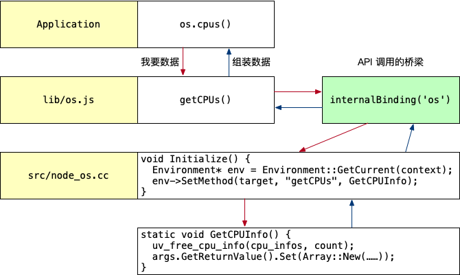

# 模块规范及内置模块

## 1. CommonJS 模块规范

> 目标：了解 CommonJS 模块规范及基本使用。

以前使用 `script` 标签加载脚本存在以下问题：

1. 脚本变多时，需要手动管理加载顺序；
2. 不同脚本之间逻辑调用，需要通过全局变量，例如 `jQuery` 的 `$`；
3. 没有 html 怎么办？

### 1.1 CommonJS 模块规范概念

CommonJS 模块规范是开发一个大型 Node.js 程序的基础，CommonJS 是由 JavaScript 社区发起的，后来在 Node.js 上被应用并推广，后续也影响到了浏览器端 JavaScript 的编写。

### 1.2 使用 require 引用外部模块

1. 新建 `ch2-3-commonjs/lib.js` 输入以下代码：

   ```js
   // 外部模块
   console.log('hello module')
   ```

2. 新建 `ch2-3-commonjs/index.js` 输入以下代码：

   ```js
   console.log('start require')
   const lib = require('./lib.js')
   console.log('end require', lib)
   ```

3. 运行 `index.js` 输出效果如下：

   ```bash
   start require
   hello module
   end require {}
   ```

4. 使用 `webpack  --mode development --no-devtool ./index.js` 可以查看 `require` 的代码实现如下：

   ```js
   function __webpack_require__(moduleId) {
     // Check if module is in cache
     var cachedModule = __webpack_module_cache__[moduleId];
     if (cachedModule !== undefined) {
       return cachedModule.exports;
     }
     // Create a new module (and put it into the cache)
     var module = __webpack_module_cache__[moduleId] = {
       // no module.id needed
       // no module.loaded needed
       exports: {}
     };

     // Execute the module function
     __webpack_modules__[moduleId](module, module.exports, __webpack_require__);

     // Return the exports of the module
     return module.exports;
   }
   ```

   **结论**：使用 `require` 引用模块时，被引用模块中的代码会**被执行一次**。

### 1.3 使用 exports 导出方法或变量

模块上下文提供了 `exports` 对象用于导出当前模块的方法或者变量。

1. 修改 `lib.js` 代码如下：

   ```js
   // exports 是模块上下文提供的对象，用于导出变量或方法
   console.log('lib 模块', exports)

   exports.username = 'zhangsan'

   exports.person = {
     name: 'zhangsan',
     age: 18,
     gender: 'male'
   }

   exports.add = (a, b) => a + b

   setTimeout(() => console.log(exports), 1000)
   ```

2. 修改 `index.js` 代码如下：

   ```js
   console.log('start require')
   const lib = require('./lib.js')
   console.log('end require', lib)

   // 向 lib 模块的 exprots 对象添加对象
   lib.testObj = { desc: 'hello module' }
   ```

3. 运行 `index.js` 输出效果如下：

   ```bash
   start require
   hello module
   lib 模块 {}
   end require {
     username: 'zhangsan',
     person: { name: 'zhangsan', age: 18, gender: 'male' },
     add: [Function (anonymous)]
   }
   {
     username: 'zhangsan',
     person: { name: 'zhangsan', age: 18, gender: 'male' },
     add: [Function (anonymous)],
     testObj: { desc: 'hello module' }
   }
   ```

### 1.4 使用模块改造石头剪刀布游戏

#### 1.4.1 需求说明

1. 用户**循环在控制台输入**：石头、剪刀、布；
2. 电脑**随机**生成石头、剪刀、布；
3. 判定胜负并输出胜负结果；
4. 如果**电脑输的次数超过三次**，终止游戏。

#### 1.4.2 代码实现

1. 新建 `ch2-3-commonjs/game.js`，复制 `ch2-2-rock.js` 的代码并改造如下：

   ```js
   exports.game = (player) => {
     console.log('玩家出拳：', player)

     // 计算机随机出拳
     const random = Math.floor(Math.random() * 3)
     let computer

     if (random === 0) {
       computer = '石头'
     } else if (random === 1) {
       computer = '剪刀'
     } else {
       computer = '布'
     }
     console.log('计算机出拳：', computer)

     // 比较结果
     if (player === computer) {
       console.log('平局')

       return 0
     } else if (
       (player === '石头' && computer === '剪刀') ||
       (player === '剪刀' && computer === '布') ||
       (player === '布' && computer === '石头')
     ) {
       console.log('你赢了')

       return 1
     } else {
       console.log('你输了')

       return -1
     }
   }
   ```

2. 修改 `ch2-3-commonjs/index.js` 代码如下：

   ```js
   const { game } = require('./game.js')

   let count = 0
   process.stdin.on('data', e => {
     const player = e.toString().trim()

     if (game(player) === 1) {
       // 记录计算机输的次数
       count++
     }
     if (count === 3) {
       console.log('你真是太厉害了，我不玩了')
       process.exit()
     }
   })
   ```

## 2. npm 包管理工具

> 目标：了解 npm 包的概念及 npm 常用命令。

npm 官网网站：<https://www.npmjs.com/>。

### 2.1 npm 包的概念

- 包：别人写的 Node.js 模块；
- npm：Node.js 的包管理工具。

CommonJS 的包规范定义由两部分组成：

- 包结构：用于组织包中的各种文件；
- 包描述文件，用于描述包的相关信息，以供外部读取分析。

### 2.2 npm 常用命令

1. 新建 `ch2-4-npm` 目录

2. **把目录初始化 npm 包**，输入以下命令：

   ```bash
   # 将当前目录初始化为 npm 包（带交互）
   npm init

   # 使用默认设置将当前目录初始化为 npm 包（不带交互）
   npm init -y
   ```

   生成的 `package.json` 的文件被称为**包描述文件**，其中：

   1. `package.json` 说明这个目录是一个 npm 包目录；
   2. `package.json` 是这个 npm 包的说明文件；
   3. 只要目录是一个 npm 包，就可以安装其他的 npm 包。

3. **安装和卸载包**

   ```bash
   # 安装指定包到依赖项 - 生产环境需要
   npm install 包名

   # 安装指定包到开发依赖 - 仅开发环境需要，生产环境不需要
   npm install 包名 -D

   # 安装 package.json 中声明的包，全新下载一套代码时使用
   npm install

   # 卸载指定的包
   npm uninstall 包名
   ```

## 3. Node.js 内置模块

> 目标：了解内置模块的**自顶向下**调用机制，知道如何使用 `EventEmitter` 实现观察者模式。

Node.js 的官方文档 <https://nodejs.org/dist/latest-v16.x/docs/api/> 罗列了 Node.js 所有的内置模块，包括：

- File system：文件系统
- Net：网络
- Stream：I/O 流
- Process：进程相关信息
- OS：操作系统相关信息
- ……

### 3.1 自顶向下调用

Node.js 源码下载地址：<https://github.com/nodejs/node/releases/tag/v16.13.0>，本小节以 `os.cpus()` 函数为例。

1. 新建 `ch2-5-modules/cpu.js` 编写如下代码：

   ```js
   const os = require('os')

   console.log(os.cpus(), os.cpus().length)
   ```

2. 运行可以查看计算机的 CPU 信息，如下所示：

   ```js
   {
     model: 'Intel(R) Core(TM) i9-9880H CPU @ 2.30GHz',
     speed: 2300,
     times: { user: 196530, nice: 0, sys: 184260, idle: 170580440, irq: 0 }
   }
   ```

3. 查看 Node.js 源文件 `lib/os.js` 可以看到如下代码：

   ```js
   function cpus() {
     // [] is a bugfix for a regression introduced in 51cea61
     const data = getCPUs() || [];
     const result = [];
     let i = 0;
     while (i < data.length) {
       ArrayPrototypePush(result, {
         model: data[i++],
         speed: data[i++],
         times: {
           user: data[i++],
           nice: data[i++],
           sys: data[i++],
           idle: data[i++],
           irq: data[i++]
         }
       });
     }
     return result;
   }
   ```

4. 在 `lib/os.js` 中查找 `getCPUs` 可以看到如下常量定义：

   ```js
   const {
     getCPUs,
     getFreeMem,
     getHomeDirectory: _getHomeDirectory,
     getHostname: _getHostname,
     getInterfaceAddresses: _getInterfaceAddresses,
     getLoadAvg,
     getPriority: _getPriority,
     getOSInformation: _getOSInformation,
     getTotalMem,
     getUserInfo,
     getUptime,
     isBigEndian,
     setPriority: _setPriority
   } = internalBinding('os');
   ```

   - 其中可以把 `internalBinding('os')` 看做是一个 API 调用的桥梁
   - 通过 `internalBinding('os')` 可以调用 `src/node_os.cc` 中的代码

5. 在 `src/node_os.cc` 中查找 `getCPUs` 可以看到如下代码：

   ```cpp
   void Initialize() {
     Environment* env = Environment::GetCurrent(context);

     env->SetMethod(target, "getCPUs", GetCPUInfo);
   }
   ```

   继续查找 `GetCPUInfo` 可以看到如下代码：

   ```cpp
   static void GetCPUInfo(const FunctionCallbackInfo<Value>& args) {
     Environment* env = Environment::GetCurrent(args);
     Isolate* isolate = env->isolate();

     uv_cpu_info_t* cpu_infos;
     int count;

     int err = uv_cpu_info(&cpu_infos, &count);

     // 以下代码省略 ……

     uv_free_cpu_info(cpu_infos, count);
     args.GetReturnValue().Set(Array::New(isolate, result.data(), result.size()));
   }
   ```

6. `os` 内置模块调用 `cpus` 函数的执行流程图如下图所示：

   

### 3.2 观察者模式 - EventEmitter

EventEmitter：<https://nodejs.org/dist/latest-v16.x/docs/api/events.html#events_class_eventemitter>。

1. 新建 `course.js` 并实现以下代码：

   ```js
   /**
    * 课程模块
    *
    * 每隔 2 秒钟派发一个事件：NEWCOURSE（推出新课程）
    */
   const { EventEmitter } = require('events')

   class Course extends EventEmitter {
     constructor() {
       super()

       setInterval(() => {
         this.emit('NEWCOURSE', { price: Math.floor(Math.random() * 100) })
       }, 2000)
     }
   }

   exports.course = new Course()
   ```

2. 新建 `index.js` 并实现以下代码：

   ```js
   const { course } = require('./course')

   course.on('NEWCOURSE', ({ price }) => {
     console.log('耶，出新课啦，只要：', price)

     if (price <= 50) {
       console.log('入手新课程')
     }
   })
   ```
